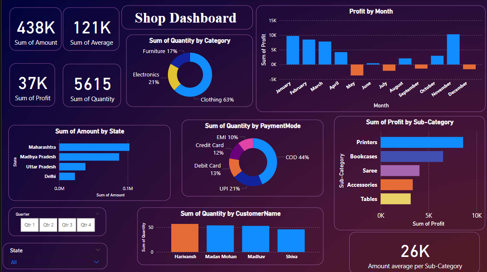

# 🛍️ Shop Dashboard - Power BI  
**A dynamic and interactive Power BI dashboard for visualizing shop sales, profits, and customer insights.**  

## 🚀 Overview  
This **Power BI Shop Dashboard** provides **actionable insights** into sales performance, profit trends, customer behavior, and payment modes. It helps businesses make **data-driven decisions** by visually analyzing key metrics like revenue, quantity sold, and profitability across different states, categories, and time periods.  

## 📊 Features  
✅ **Key Metrics at a Glance** - Total sales, profit, and quantity sold.  
✅ **Category & Payment Insights** - Breakdown of products sold and payment modes used.  
✅ **Profit Trends Over Time** - Monthly profit analysis to track performance.  
✅ **State-wise Sales** - Identifies top-performing regions.  
✅ **Customer Analysis** - Insights into customer purchasing patterns.  
✅ **Quarter & State Filters** - Enables dynamic data exploration.  

## 🛠️ Tech Stack  
- **Power BI** - Data visualization and dashboard creation  
- **DAX & Power Query** - Data transformation and calculations  
- **SQL/Python (Optional)** - Used for preprocessing (if applicable)  

## 📸 Dashboard Preview  
<!-- Add relevant images/screenshots here -->
  

## 🎯 Impact  
🔹 Identified top-selling products and profitable months.  
🔹 Helped businesses optimize sales strategies based on data.  
🔹 Provided insights into customer payment preferences for better marketing strategies.  

## 📂 How to Use  
1️⃣ Clone this repository.  
2️⃣ Open the `.pbix` file in Power BI Desktop.  
3️⃣ Connect your dataset (if needed).  
4️⃣ Explore insights with **interactive filters** and **visualizations**.  

## 🏆 Why This Project?  
This project demonstrates my **data visualization** and **business intelligence** skills, translating raw data into meaningful insights. It showcases my ability to **build dashboards that drive real business impact**.  

---

🔗 **Connect with me:** [LinkedIn]([http://www.linkedin.com/in/pavan-khamitkar-098799239) | [GitHub](https://github.com/PavanKhamitkar)  
